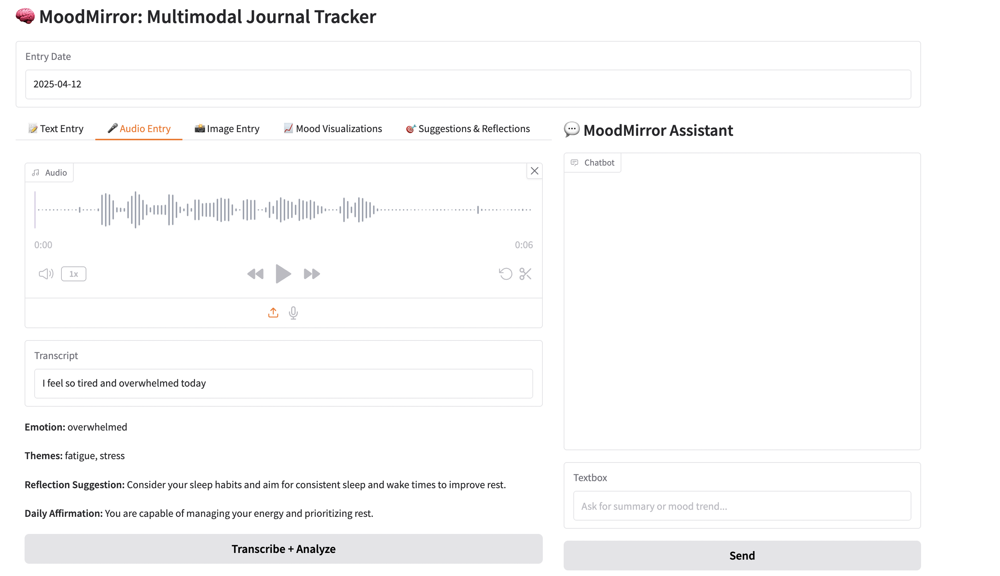
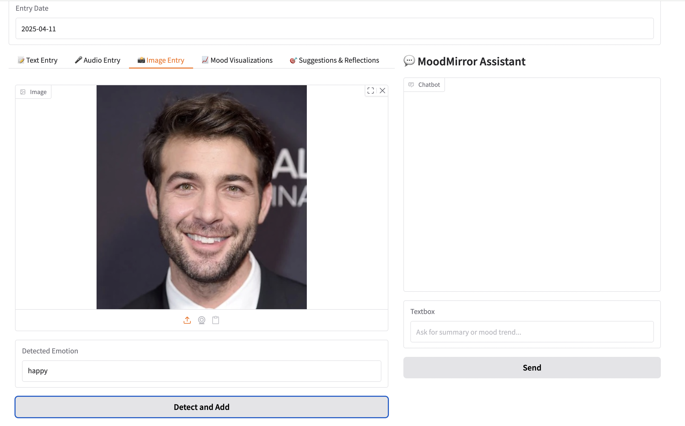
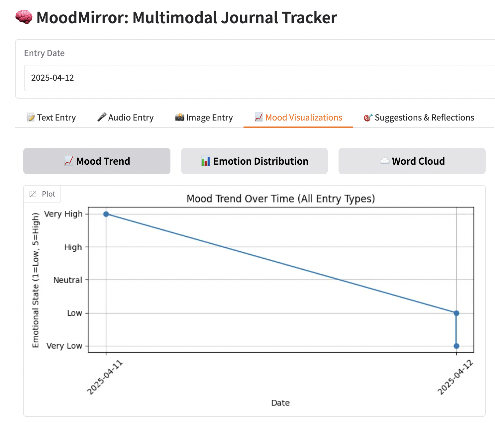
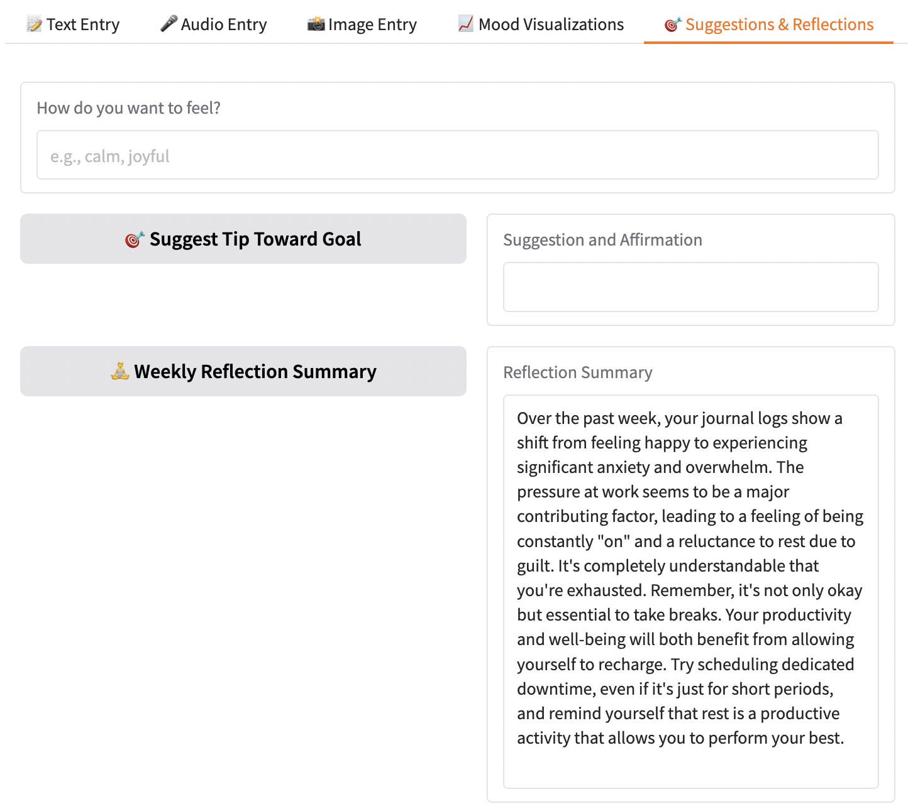
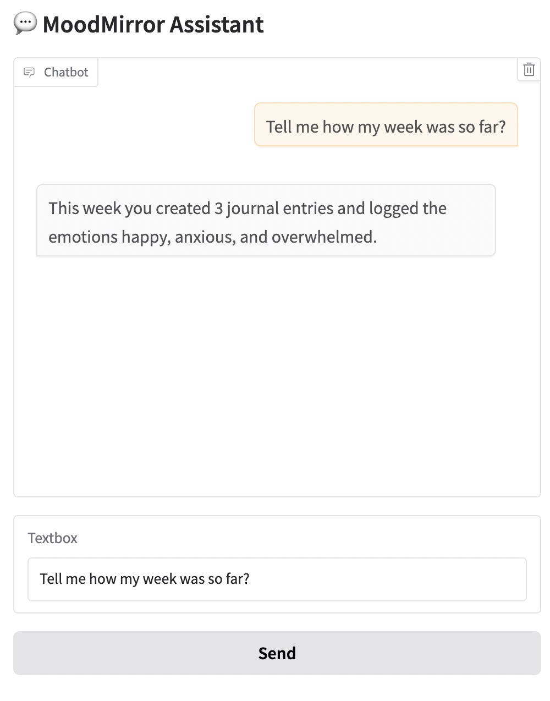

# MoodMirror: A Multi-Modal Journaling Assistant Powered by Gen AI

## 🧠 Why MoodMirror?

In an age where mental health challenges are on the rise and people are constantly navigating stress, anxiety, and burnout, self-reflection has become more essential than ever. Yet journaling — one of the most effective tools for emotional clarity — often lacks structure, feedback, and personalization.

That’s where **MoodMirror** comes in.

**MoodMirror** is an AI-powered, multimodal journaling assistant that listens, reads, and sees. Whether you write down your thoughts, record a voice note, or upload a selfie, MoodMirror analyzes your entries and reflects back structured insights — emotional patterns, suggestions, affirmations, and visualizations that guide your self-awareness journey.

This was developed as part of the **5-day Gen AI Intensive Course with Google** and is my capstone project for the program.

---

## 💡 The Use Case: Turning Reflection Into Guidance — with Gen AI

**The Problem:** Journaling is widely known to improve mental health, but most people struggle with consistency, reflection, or even knowing *what to write*. Traditional apps offer digital notebooks, but little insight — and none adapt to *how* you choose to express yourself: through words, voice, or images.

**The Idea:** What if your journaling app could do more than store thoughts? What if it could *understand* them? MoodMirror was born from this question — a journaling assistant that listens to your voice, analyzes your writing, or reads your face — and then reflects something back: **insight, encouragement, patterns, and care**.

**The Solution:** MoodMirror uses **Generative AI** to turn raw emotion into actionable reflection. With **Gemini 2.0 Flash**, we analyze text and voice entries using:

- **Structured output (JSON mode)** for consistent insights
- **Few-shot prompting** to teach the model how to respond empathetically
- **Retrieval-Augmented Generation (RAG)** to ground suggestions in real, curated wellness strategies

Combined with **image understanding** (via FER) and **speech-to-text** pipelines, the tool brings together multiple Gen AI capabilities into a unified emotional assistant.

> Journaling becomes more than expressive.> It becomes *interactive* — and even healing.

---

## 🔧 How It Works (with Gen AI!)

### 1. ✍️ Text Entry → Structured Insights

At the core of MoodMirror is **Gemini 2.0 Flash**, which processes text entries using few-shot prompting and structured output (JSON mode). Each journal is grounded in context via RAG, selecting the most relevant mental wellness documents.

```python
config = types.GenerateContentConfig(
    temperature=0.9,  # Increased to encourage more randomness
    top_k=5,         # Number of top tokens to consider at each step
    response_mime_type="application/json",
    response_schema=JournalAnalysis
)
response = client.models.generate_content(
    model="gemini-2.0-flash",
    contents=[prompt],
    config=config
)
```

It returns:

- **Primary Emotion** (e.g., anxious, relieved)
- **Themes** (e.g., burnout, productivity)
- **CBT-Style Suggestion**
- **Affirmation**

**Screenshot of Text Entry Example:**

*Example of a journal entry and its processed structured insights.*

### 2. 🎤 Audio Support

MoodMirror uses **Google Speech Recognition** to transcribe `.m4a` or `.wav` voice notes. 
The transcript is passed through the same analysis pipeline.

**Screenshot of Audio Entry Example:**

*Example of a voice note being transcribed and analyzed for insights.*

### 3. 📸 Emotion from Images

Upload a selfie, and MoodMirror uses **FER (Facial Emotion Recognition)** with **facenet-pytorch** to analyze expressions like happy, sad, neutral, or angry.

**Screenshot of Image Entry Example:**

*Example of an image being processed and emotion analysis displayed.*

### 4. 📊 Mood Visualization

Your data doesn’t disappear. MoodMirror visualizes:

- 🪄 **Mood Trend Line** over time.
- 📊 **Emotion Distribution** across entries.
- ☁️ **Word Cloud** of recurring thoughts.

**Screenshot of Mood Visualization Example:**

*Example of a mood trend visualization over time based on user entries.*


### 5. 🗓 Weekly Summary
At the end of each week, MoodMirror generates a summary of your emotional journey, highlighting the primary emotions and themes that emerged, as well as any actionable suggestions for improvement.

**Screenshot of Weekly Summary Example:**

Example of the weekly summary showing insights and suggestions based on entries.

### 6. 💬 Chatbot Interaction
In addition to visual insights, MoodMirror also features a chatbot that engages with you to provide real-time support, answer questions, and offer encouragement based on the emotions and themes detected in your entries.

**Screenshot of Chatbot Example:**

Example of a chatbot conversation providing personalized feedback and support.
---

## 🔗 Try It Out

Want to experiment with it yourself?👉 [Run the Notebook on Kaggle](https://www.kaggle.com/code/saharbadihi/moodmirror-capstone-project) *(link will be updated with final submission)*

---

## 💬 Final Thoughts

MoodMirror reimagines journaling as a deeply interactive, multi-sensory experience. By integrating Gen AI and multimodal inputs, it creates space for reflection, growth, and emotional clarity — all with the click of a button.

It's not just about writing your feelings down. It’s about having them understood.

Thanks to the Gen AI team at Google for the opportunity to build this project.
